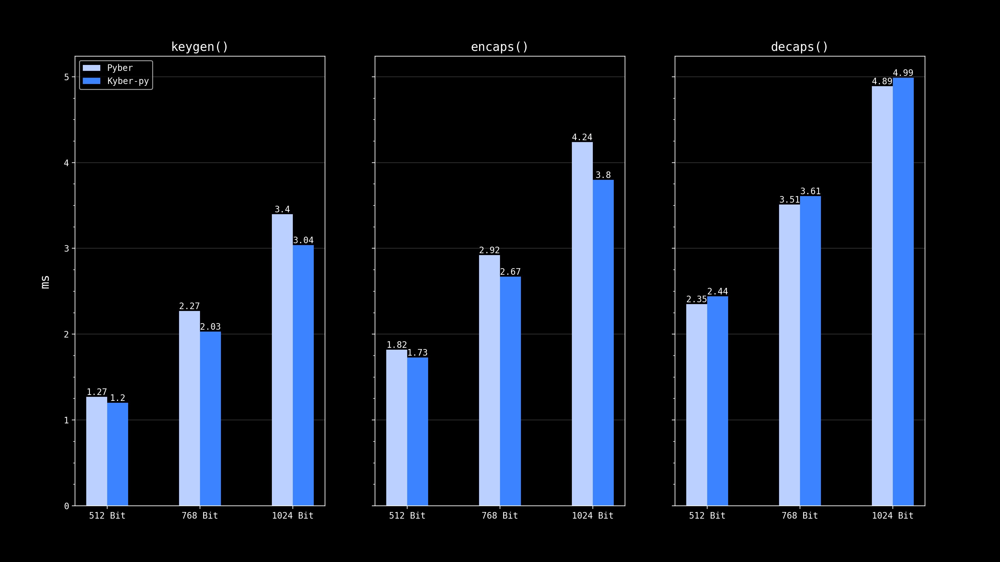

# Pyber – ML-KEM
A pure Python implementation of ML-KEM (FIPS 203), built to understand the underlying mathematics and cryptography.

Validated against [ACVP](https://github.com/usnistgov/ACVP-Server/tree/master/gen-val/json-files) and [C2SP](https://github.com/C2SP/CCTV/tree/main/ML-KEM/intermediate) test vectors for all three parameter sets (ML-KEM-512, ML-KEM-768, ML-KEM-1024).

> [!CAUTION]
> This project is for educational purposes only. It is not hardened, not audited, and must not be used in real cryptographic applications.

## Installation

```bash
git clone https://github.com/valentinfrm/pyber.git
cd pyber
uv sync
```

## Using pyber

### Exposed functions in `kem.py`:

- `keygen()`: generate a keypair (ek, dk)
- `keygen_checked()`: generate a keypair (ek, dk) with fault attack resistance
- `encaps(ek)`: generate a key and ciphertext pair (key, c)
- `decaps(dk, c)`: generate the symmetric key

### Example

```python
from pyber.kem import keygen, keygen_checked, encaps, decaps

# Key generation (use keygen_checked() for fault attack resistance)
public_key, private_key = keygen()

# Encapsulation
symmetric_key, ciphertext = encaps(public_key)

# Decapsulation
symmetric_key_dec = decaps(private_key, ciphertext)

assert symmetric_key == symmetric_key_dec
```

## Performance

Fastest observed runtime over 20 runs on APPLE m1:



## References

- [FIPS 203 - ML-KEM Standard](https://nvlpubs.nist.gov/nistpubs/FIPS/NIST.FIPS.203.pdf) — NIST
- [Kyber and Dilithium](https://cryptography101.ca/kyber-dilithium/) — Alfred Menezes, University of Waterloo
- [Conceptual Review on Number Theoretic Transform and Comprehensive Review on Its Implementations](https://ieeexplore.ieee.org/document/10177902)
- [kyber-py](https://github.com/GiacomoPope/kyber-py)